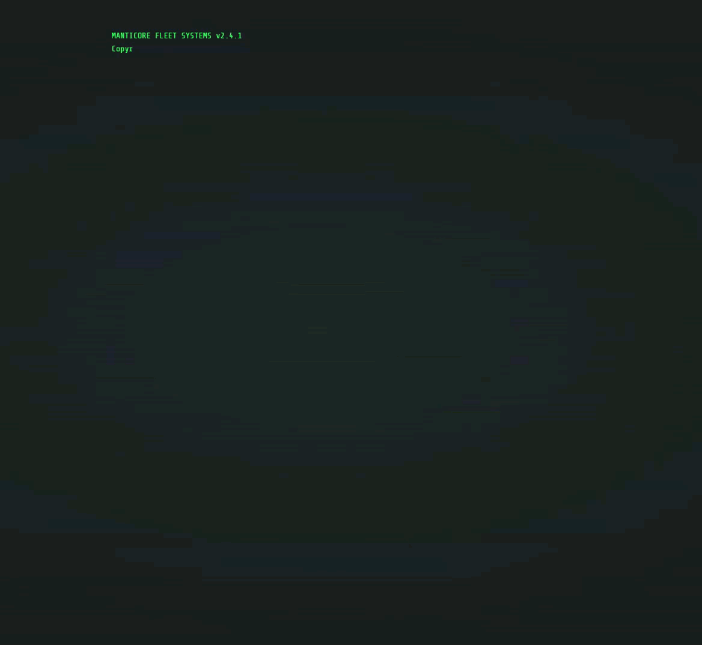
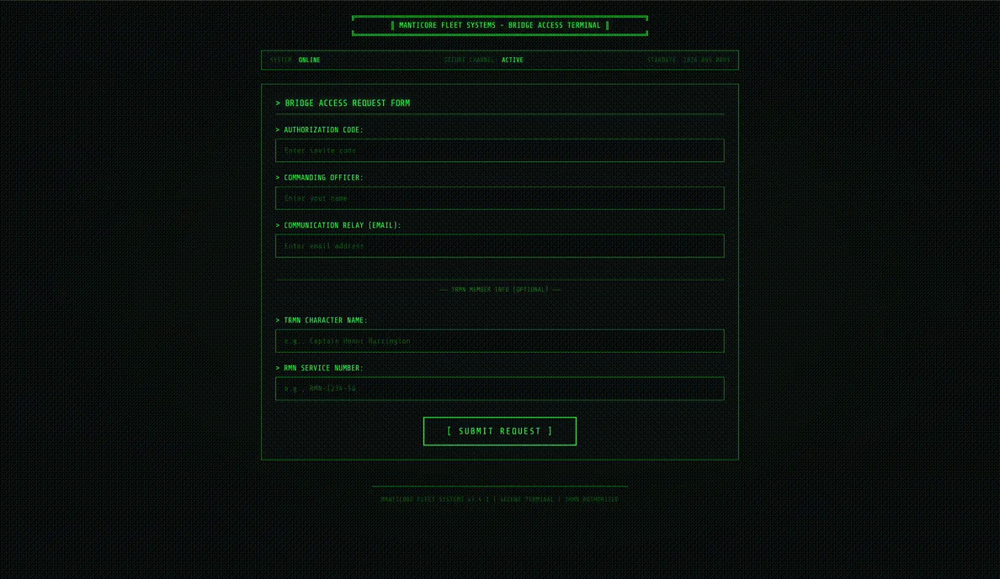
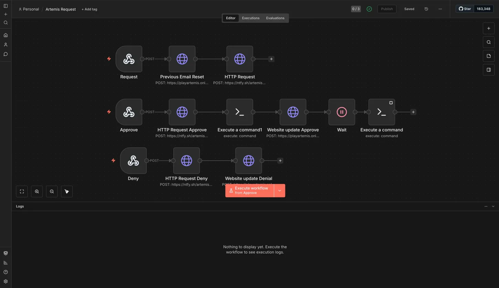
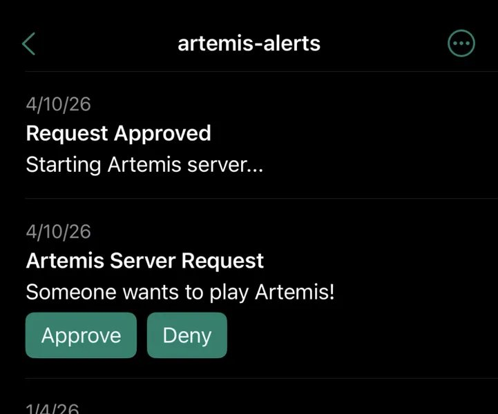
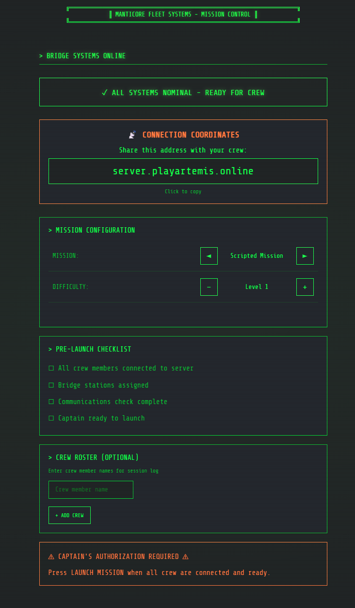

# PlayArtemis.Online

**Remote bridge access for Artemis Spaceship Bridge Simulator -- powered by automation.**

Ever wanted to play a starship bridge simulator with your friends without everyone needing to be in the same room? I wanted that to exist, so I built it.

Artemis Spaceship Bridge Simulator is an existing cooperative multiplayer game created by Thom Robertson ([artemisspaceshipbridge.com](https://www.artemisspaceshipbridge.com)), where players each take a station on a starship bridge -- helm, weapons, engineering, communications. Think Star Trek, but you and your friends are actually running the ship. This project automates the process of spinning up and managing an Artemis server remotely.

*Not familiar with Artemis? [Watch the Rev3 Games overview](https://www.youtube.com/watch?v=V9Q2X32hZNk)*

[PlayArtemis.Online](https://playartemis.online) is an end-to-end automated session management system that lets TRMN members request and play Artemis Spaceship Bridge Simulator sessions on demand from anywhere in the world. When a request comes in, I get a push notification to approve or deny it. If approved, the system handles everything else automatically -- no further input from me required.

---

## How it works

1. **Request** -- A player submits a request through the retro terminal-themed web interface, providing their name, email, and optionally their TRMN character details
2. **Approval** -- I receive a push notification on my phone with Approve/Deny buttons
3. **Wake** -- On approval, the system sends a Wake-on-LAN packet to bring the dedicated Artemis PC online
4. **Launch** -- Automated GUI scripting starts Artemis and configures it for the session
5. **Play** -- The requestor receives connection details and can begin their session
6. **Wrap-up** -- When the session ends, a summary email is automatically sent to the requestor

---

## Screenshots

### Bridge Access Terminal

### Automation Pipeline (n8n)

### Approval Notification (ntfy)

### Bridge Systems Online

---

## Stack

| Component | Technology |
|---|---|
| Request Form | Custom HTML/CSS (Manticore Fleet Systems terminal theme) |
| Automation Pipeline | n8n |
| Push Notifications | ntfy |
| Hardware Wake | Wake-on-LAN |
| Game Launch | GUI automation / shell scripting |
| Infrastructure | Self-hosted |

---

## Notes

This project was built primarily for use by members of [TRMN (The Royal Manticoran Navy)](https://trmn.org) fan organization. It is not open for public contributions or deployment. This repo exists as a portfolio showcase.

*AI tools helped me build it faster than I could have alone -- which is increasingly just how I work.*
